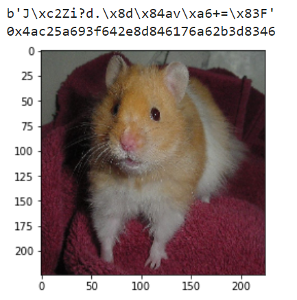
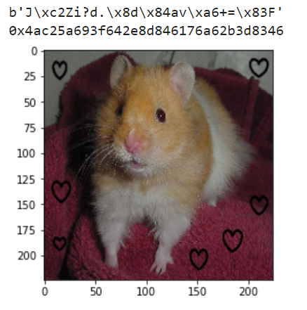
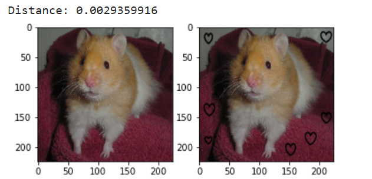

# ImageDeepHash
## Deep Hash
```python
from src import ImageDeepHash

m = ImageDeepHash.ImageDeepHash()
m.hash("ILSVRC2012_val_00005002.jpeg")
print(m.digest())
print(m.hexdigest())
m.plot()
```
<p align="center">
  
</p>

```python
m.reset()
m.hash("ILSVRC2012_val_00005002_noise.jpeg")
print(m.digest())
print(m.hexdigest())
m.plot()
```

<p align="center">
  
</p>

<b>Or using <a href="https://github.com/ffyyytt/ImageDeepHash#run-using-google-colab-with-ngrok">website</a></b>:
<p align="center">
  
  
</p>

## Deep Compare
```python
from src import ImageDeepCompare

m = ImageDeepCompare.ImageDeepCompare()
print("Distance:", m.compare("ILSVRC2012_val_00005002.jpeg", "ILSVRC2012_val_00005002_noise.jpeg", "euclidean"))
m.plot()
```
<p align="center">
  
</p>
 
<b>Or using <a href="https://github.com/ffyyytt/ImageDeepHash#run-using-google-colab-with-ngrok">website</a></b>:
<p align="center">
  
  </br>
  
</p>
## **Run using Google Colab with Ngrok**
- Open notebook and follow the instructions [](https://colab.research.google.com/drive/1N2AyKf_G8ImdRdpgpzLbyQf0PgH7jwlt?usp=sharing)
